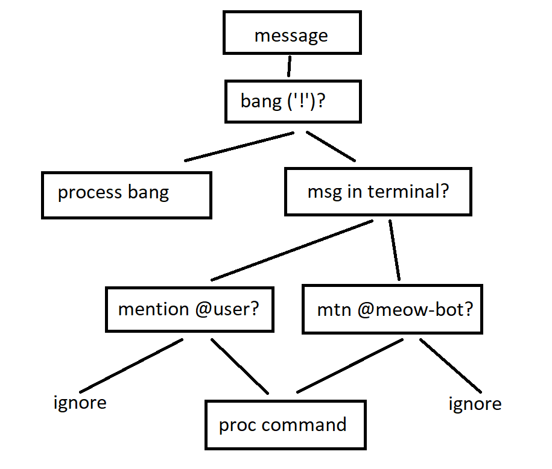

# meow-bot

## Setup
meow-bot requires the following dependencies:  
- `discord.js`

Clone the repo and install dependencies with the following commands:  
```
npm install discord.js ffmpeg fluent-ffmpeg @discordjs/opus ytdl-core --save
```

## meow-bot commands logic tree



## Configuring the Raspberry Pi
`meow-bot` was written using Node v12+. As of this writing, the highest Node version officially supported by my Raspberry Pi model B (`armv6`) is v10.19.0, which breaks on some missing functions. I had to manually install an unsupported build of v12.18.3 using the following commands and [this thread](https://gist.github.com/davps/6c6e0ba59d023a9e3963cea4ad0fb516):
```
wget https://unofficial-builds.nodejs.org/download/release/v12.18.3/node-v12.18.3-linux-armv6l.tar.gz
tar -xzf node-v12.18.3-linux-armv6l.tar.gz
cd node-v12.18.3-linux-armv6l
sudo cp -R * /usr/local

export PATH=$PATH:/usr/local/bin

node -v
npm -v
```
The last two showed `v12.18.3` and `6.14.6` respectively.

## Setting up Node on WSL
Microsoft recommends using a version manager (specifically `nvm`) to track `nodejs` versions on Windows Subsystem for Linux.
```
sudo apt install nvm
```
_restart the terminal, check using next command_
```
command -v nvm
nvm install node #latest version, with bugs
nvm install node --lts #latest lts version, fewest bugs
nvm install 12.20.0 #specific version of nodejs
nvm ls-remote #list available versions for download
nvm use [12.20.0 | node | --lts] #switch to specific version
```